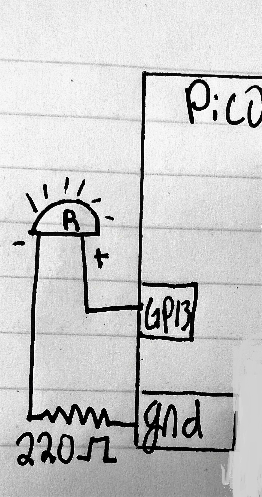

# Engineering_4_Notebook

&nbsp;
### My Table of Contents Never Works:(
&nbsp;

## Launch_Pad_Part_1_(Countdown)

### Assignment Description

Today Ellen and I wrote code to make a countdown from 10 on the serial monitor. We had to write code to import the pico correctly and ensure we had all the downloaded extensions. We did this to incorporate it into our final python assignment later. 

### Evidence 

  

### Code
```
import time    #time variable
for x in range(10,0,-1):  #counting range of numbers
    print(x)         #says each number
    time.sleep (1)   #rest 1 sec for a pause
print("LAUNCHY")     #say this at the end of 10s
```

### Reflection

We had some difficulty getting the countdown to count down from ten as opposed to counting up from 1, but other than that, this task was pretty straightforward. Another minor issue was figuring out the best way to run the pico, as this was our first assignment. Thankfully there was no wiring, and we could get this assignment done relatively quickly. We got a nice introduction to pico and learned the basics.

## Launch Pad Part 2 (Lights)

### Assignment Description

Today Ellen and I created code to make a red light flash as the serial monitor counts down from ten and then flashes a red light when the word 'launch' is printed. We wrote this code as a part of our 4pt python assignment. This will be useful later in the year if we need LEDs for our project or something that functions similarly through code or practice.

### Evidence 

  

### Code

```
import time #Imports variables
import board
import digitalio 

led1 = digitalio.DigitalInOut(board.GP13) #says that the first led is at pin 13
led1.direction = digitalio.Direction.OUTPUT #gives direcction
led2 = digitalio.DigitalInOut(board.GP18) #says the second led is at pin 18
led2.direction = digitalio.Direction.OUTPUT #gives direction

for x in reversed(range(11)): 
    led1.value = True #turns light on
    time.sleep(0.5) #wait time
    print(x) #tells it what to say
    led1.value = False #turns led off
    time.sleep(0.5) #wait time
while True:
    print("liftoff!") #says liftoff
    led2.value = True #turns red light on
    time.sleep(0.5) #tells it when to sleep
```
### Wiring

[Diagram](images/Wiringdiagram1.jpg)

### Reflection

We struggled to get the correct light to light up during the countdown. We eventually figured out the problem was that we had misidentified our LEDs, so it's important to label things because it makes things more organized and easier to use or understand later. This assignment will be helpful in the following two launch pad assignments along with our pi in the sky project.

## Launch Pad Part 3 (Button)

### Assignment Description

This is for our 4 part python assignment. Today Ellen and I created code to make the countdown and lights start when we press a button. We did this to mimic a realistic countdown that is started with an ignition.

### Evidence 

  

### Code

```
import time #imports
import board
import digitalio

led1 = digitalio.DigitalInOut(board.GP13) #pins 
led1.direction = digitalio.Direction.OUTPUT
led2 = digitalio.DigitalInOut(board.GP18)
led2.direction = digitalio.Direction.OUTPUT
button = digitalio.DigitalInOut(board.GP16) #adds in the button
button.direction = digitalio.Direction.INPUT
button.pull = digitalio.Pull.UP #incorperates the button into the circuit

while True: #if the button is pressed this will happen
     if button.value == False:
          for x in reversed(range(11)):
               led1.value = True #light on
               time.sleep(0.5) #light rest
               print(x)
               led1.value = False #light off
               time.sleep(0.5)
          while True:
               print("liftoff!") #prints liftoff
               led2.value = True
               time.sleep(0.5)
```

### Wiring

[Wiring Diagram](images/B2891F05-A75D-4551-ACE8-1FF7697E1B06.jpeg)

### Reflection

So as a group with minimal experience and a strong dislike for coding, this took a lot of questioning and thinking. We were adding to our previous code and wiring, but we have never used a button, much less coded for it, so that was new. Our main issue was that we didn't know where to put the new code (again). We had to figure out how to use the correct imports in order to print the correct code.

## Launch Pad Part 4 (Servo)

### Assignment Description

Today Ellen and I created code to make the coundown and lights start when we press a button and at the end it will make a servo turn at 180 degrees. This is for our 4pt pyhton assignment.

### Evidence 

  

### Code

```
import time    #importing stuff
import board
import digitalio
import pwmio 
from adafruit_motor import servo

led1 = digitalio.DigitalInOut(board.GP13)
led1.direction = digitalio.Direction.OUTPUT
led2 = digitalio.DigitalInOut(board.GP18)
led2.direction = digitalio.Direction.OUTPUT
button = digitalio.DigitalInOut(board.GP16)  #what stuff is going in vs out and where it's at
button.direction = digitalio.Direction.INPUT
button.pull = digitalio.Pull.UP
pwm_servo = pwmio.PWMOut(board.GP5, duty_cycle=2 ** 15, frequency=50)  #setting up servo
servo1 = servo.Servo(pwm_servo, min_pulse=500, max_pulse=2500)

servo1.angle = 0


while True: 
     if button.value == False:    #so when we aren't pressing it anymore
          for x in reversed(range(11)):
               led1.value = True
               time.sleep(0.5)     #rest a sec between counts
               print(x)
               led1.value = False
               time.sleep(0.5)
          while True:
               print("liftoff!")     #say liftoff
               led2.value = True
               servo1.angle = 180     #turn180
               time.sleep(0.5)
 ```

### Wiring

[Wiring Diagram](https://github.com/gdaless20/Engineering_4_Notebook/blob/main/images/605AF562-1631-4CA0-96F3-7A6D2509CADD.jpeg)

### Reflection

The servo code was given in the assignment, and you just had to add it to the end of the While True, so the assignment went pretty smoothly. I ignored the pin map, which was probably the disconnect. We were in the wrong pin because I thought the 7th pin down was GP7, but it was GP5, so once we had that figured out, the servo worked, and we were done.

## Crash Avoidance Part 1

### Assignment Description

Today Ellen and I created code to make an accelerometer that continuously reports x, y, and z acceleration values on our serial monitor.

### Evidence 

  

### Code

```
import time #imports
import board
import adafruit_mpu6050
import busio

sda_pin = board.GP14 #Sda connect
scl_pin = board.GP15 #Scl connect 
i2c = busio.I2C(scl_pin, sda_pin) 
mpu = adafruit_mpu6050.MPU6050(i2c) #Mpu adafruit

while True:
    print("Acceleration: X:%.2f, Y: %.2f, Z: %.2f m/s^2" % (mpu.acceleration)) #prints co-ords
    print("Gyro X:%.2f, Y: %.2f, Z: %.2f rad/s" % (mpu.gyro)) 
    print("Temperature: %.2f C" % mpu.temperature) #prints temp
    print("")
    time.sleep(1) 
 ```
### Wiring

  

### Reflection

After downloading the necessary folder modules needed for this code, it goes pretty smoothly. You need to have Acceleration, temperature, and gyro in order to find all the values for the assignment. Don't be alarmed by the ~9.8 because that's just the force of gravity and is not going to mess with your values or anything. There was no wiring so i helped ellen with doing research on how to complete the code.

## Crash Avoidance Part 2

### Assignment Description

We had to get an accelerometer working so that when it was 90 degrees an led would turn on along with having a powerboost.

### Evidence 

  

### Code

```
import board  #import stuff
import adafruit_mpu6050
import busio 
import time
import digitalio 

led_1 = digitalio.DigitalInOut(board.GP18)   #led setup
led_1.direction = digitalio.Direction.OUTPUT
sda_pin = board.GP14   #setup pico
scl_pin = board.GP15
i2c = busio.I2C(scl_pin, sda_pin)
mpu = adafruit_mpu6050.MPU6050(i2c)


while True:
    print(mpu.acceleration)   #say the values
    time.sleep(.5)

    if mpu.acceleration[0] < -9 or mpu.acceleration[0] > 9:
        led_1.value = True  #at 90 degrees led is on

    else:
        led_1.value = False  #if not led is off
```

### Wiring

[Wiring Diagram](images/A1C4311C-59DF-4F92-8CC7-69A7C77432B8.jpeg)

### Reflection

I messed up the led wiring and almost blew up an LED but after i fixed that issue our code worked well! After importing everything you setup your led and wiring (double check that you are in the correct pins, i2c are still 2 pins off). The only thing you have to make sure you do is have the correct angle and degrees for the mpu.acceleration, we want it at 90 so when it's vertical the light will come on.


## Crash Avoidance Part 3

### Assignment Description

I had to get my led to blink at 90 degrees and print gyro xyz values onto a screen as well.

### Evidence 

  

### Code

```
import board  #imports
import adafruit_mpu6050
import busio 
import time
import digitalio 
import terminalio
import displayio
from adafruit_display_text import label
import adafruit_displayio_ssd1306

displayio.release_displays()
sda_pin = board.GP14   #setup pico
scl_pin = board.GP15
i2c = busio.I2C(scl_pin, sda_pin)
display_bus = displayio.I2CDisplay(i2c, device_address=0x3d, reset=board.GP28)
display = adafruit_displayio_ssd1306.SSD1306(display_bus, width=128, height=64)
led_red = digitalio.DigitalInOut(board.GP18)   #led setup
led_red.direction = digitalio.Direction.OUTPUT

mpu = adafruit_mpu6050.MPU6050(i2c, address=0x68) #accelerometer


while True:
    print(mpu.acceleration)   #say the values
    time.sleep(.5)
    print("Gyro X:%.2f, Y: %.2f, Z: %.2f rad/s" % (mpu.gyro))
    splash = displayio.Group()  #create the display group

    title = "ANGULAR VELOCITY" #add title block to display group
    text_area = label.Label(terminalio.FONT, text=title, color=0xFFFF00, x=5, y=5)
    splash.append(text_area) 

    title = f"x: {mpu.gyro[0]}" 
    text_area = label.Label(terminalio.FONT, text=title, color=0xFFFF00, x=5, y=15) # determines and prints x value
    splash.append(text_area)  
    
    title = f"y: {mpu.gyro[0]}" 
    text_area = label.Label(terminalio.FONT, text=title, color=0xFFFF00, x=5, y=30) # figures and and says y value
    splash.append(text_area) 

    title = f"z: {mpu.gyro[0]}" 
    text_area = label.Label(terminalio.FONT, text=title, color=0xFFFF00, x=5, y=45) # same thing with z
    splash.append(text_area)


    display.show(splash) #send display group to screen
    if mpu.acceleration[0] < -9 or mpu.acceleration[0] > 9:
        led_red.value = True  #at 90 degrees led is on

    else:
        led_red.value = False  #if not led is off
```
### Wiring

[Wiring Diagram](images/IMG_9303.jpg)

### Reflection

We forgot to use the code to find the addresses of the devices so that tripped me up for a while. To find the addresses, run this code and be sure to check which address is for each device. Also be sure to check your wiring because i2c wiring is always off 2 pins. Additionally i felt the wiring was a little tricky as the OLED screen uses different pin inputs and outputs and i had to make sure to line up the correct Data and Rst pins. I learned how to wire up an OLED screen and we plan to use it in our Pi in the sky project.

## Landing Area pt 1

### Assignment Description

I had to get my serial monitor to take my chosen coordinates of a triangle and tell me the area.

### Evidence 

  

### Code
```
import math
def tri_area(x1, y1, x2, y2, x3, y3):
    niceAreaValue = (abs(x1*(y2-y3)+x2*(y3-y1)+x3*(y1-y2)))/2   # the math is mathing
    print(f"The area of the triangle with vertices ({x1}, {y1}), ({x2}, {y2}), ({x3}, {y3}) is {niceAreaValue}")  # print coordinates so you can fill it out
while True:
    try:
        txt1 = input("Input coord set 1 (x,y)") # input coordinates
        set1 = txt1.split(",")

        a1 = float(set1[0])
        b1 = float(set1[1])

        txt2 = input("Input coord set 2 (x,y)")  # input coordinates
        set2 = txt2.split(",")

        a2 = float(set2[0])
        b2 = float(set2[1])

        txt3 = input("Input coord set 3 (x,y)") # input coordinates
        set3 = txt3.split(",")

        a3 = float(set3[0])
        b3 = float(set3[1])

        tri_area(a1, b1, a2, b2, a3, b3)

except:
        print("Please input valid coordinates (remember format x,y)")  # if u suck, it lets you know
```

### Reflection

Using Try, you can input different coordinates and it allows you to try them, however you can use except with it so that when incorrect coordinates are used it stops the code and tells you to retry. This is convenient and fairly simple to use which makes it something you can use in mnay different code setups. The area formulas take your given coordinates and do the math of getting the triangle area for you. This will be helpful for our final project to calculate the area of where we want our platform to land.


## Landing Area pt 2

### Assignment Description

I had to get my serial monitor to take my chosen coordinates of a triangle and tell me the area and then graph it on the oled screen.

### Evidence 

  

### Code

```
import math
import board
from adafruit_display_shapes.triangle import Triangle
from adafruit_display_shapes.line import Line
from adafruit_display_shapes.circle import Circle  #import shiz
import displayio
import adafruit_displayio_ssd1306
import busio

displayio.release_displays()
sda_pin = board.GP14
scl_pin = board.GP15
i2c = busio.I2C(scl_pin, sda_pin)  # setting stuff up

display_bus = displayio.I2CDisplay(i2c, device_address=0x3d, reset=board.GP19)
display = adafruit_displayio_ssd1306.SSD1306(display_bus, width=128, height=64) # screen setup


def tri_area(x1, y1, x2, y2, x3, y3):
    niceAreaValue = (abs(x1*(y2-y3)+x2*(y3-y1)+x3*(y1-y2)))/2  #these are my triangle coordinates
    print(f"The area of the triangle with vertices ({x1}, {y1}), ({x2}, {y2}), ({x3}, {y3}) is {niceAreaValue}")  # Area with vertices
while True:
    try:
        txt1 = input("Input coord set 1 (x,y)")  #COORDINATES
        set1 = txt1.split(",")

        a1 = float(set1[0])
        b1 = float(set1[1])

        txt2 = input("Input coord set 2 (x,y)")
        set2 = txt2.split(",")

        a2 = float(set2[0])
        b2 = float(set2[1])

        txt3 = input("Input coord set 3 (x,y)")
        set3 = txt3.split(",")

        a3 = float(set3[0])
        b3 = float(set3[1])

        tri_area(a1, b1, a2, b2, a3, b3)  #area

        c1 = int(a1)
        d1 = int(b1)

        c2 = int(a2)
        d2 = int(b2)

        c3 = int(a3)
        d3 = int(b3)

        splash = displayio.Group()

        hline = Line(0, 32, 128, 32, color=0xFFFF00)
        splash.append(hline)

        hline = Line(64, 64, 64, 0, color=0xFFFF00)
        splash.append(hline)

        circle = Circle(64, 32, 6, outline=0xFFFF00)  #sets up size too
        splash.append(circle)


        triangle = Triangle(c1, d1, c2, d2, c3, d3, outline=0xFFFF00)  #area mATHING
        splash.append(triangle)
        display.show(splash)
    except:
        print("Please input valid coordinates (remember format x,y)") #u suck, fix it
```

### Wiring

  


### Reflection

Our biggest issue was not being able to see our triangle on the screen because our screen's x and y scale was different then expected. Once we adjusted to fit the screen, our coordinates made a nice triangle that was clearly visible on the screen. We adjusted the location of the triangles by adding numbers to the hline which moved the trianlges into visible quadrants of the screen. I had to double check that the wiring was still correct on our bread board.


## Morse Code pt 1

### Assignment Description

I had to write code so that whatever message you type in is then translated into morse code.

### Evidence 

  

### Code

```
MORSE_CODE = { 'A':'.-', 'B':'-...',  #dictionary
    'C':'-.-.', 'D':'-..', 'E':'.',
    'F':'..-.', 'G':'--.', 'H':'....',
    'I':'..', 'J':'.---', 'K':'-.-',
    'L':'.-..', 'M':'--', 'N':'-.',
    'O':'---', 'P':'.--.', 'Q':'--.-',
    'R':'.-.', 'S':'...', 'T':'-',
    'U':'..-', 'V':'...-', 'W':'.--',
    'X':'-..-', 'Y':'-.--', 'Z':'--..',
    '1':'.----', '2':'..---', '3':'...--',
    '4':'....-', '5':'.....', '6':'-....',
    '7':'--...', '8':'---..', '9':'----.',
    '0':'-----', ',':'--..--', '.':'.-.-.-',
    '?':'..--..', '/':'-..-.', '-':'-....-',
    '(':'-.--.', ')':'-.--.-'}


mouse1 = input("Mouse code set 1 (x,y)")  #input
mouse1 = mouse1.upper() #make things uppercase

cheese = " " #total strings

for letter in mouse1: # use MORSE_CODE[letter] here to translate from input into morse code
   cheese = cheese + (MORSE_CODE[letter]) + " " #stacks letters

print(cheese) #write it

```

### Reflection

My variables may seem confusing at first, but essentially Cheese is the strings and connects them so that everything is more smoothly connected. Mouse is the alphabet and how the code works together. Using a dictionary is convenient because it allows you to use many variables and in this case, it allows you to use any letter of the alphabet and number/character to express a message. There was no wiring in this assignment which made it go quick. We learned how to use the Morse code library which can be helpful in our future project.

## Morse Code pt 2

### Assignment Description

I had to write code so that when you type a mesage into the terminal, it's translated into morse code and then an LED blinks to spell out the message.

### Evidence 

  

### Code

```
import board
import digitalio
import time #imports

MORSE_CODE = { 'A':'.-', 'B':'-...',  #dictionary, goes on top
    'C':'-.-.', 'D':'-..', 'E':'.',
    'F':'..-.', 'G':'--.', 'H':'....',
    'I':'..', 'J':'.---', 'K':'-.-',
    'L':'.-..', 'M':'--', 'N':'-.',
    'O':'---', 'P':'.--.', 'Q':'--.-',
    'R':'.-.', 'S':'...', 'T':'-',
    'U':'..-', 'V':'...-', 'W':'.--',
    'X':'-..-', 'Y':'-.--', 'Z':'--..',
    '1':'.----', '2':'..---', '3':'...--',
    '4':'....-', '5':'.....', '6':'-....',
    '7':'--...', '8':'---..', '9':'----.',
    '0':'-----', ',':'--..--', '.':'.-.-.-',
    '?':'..--..', '/':'-..-.', '-':'-....-',
    ' ': '/',
    '(':'-.--.', ')':'-.--.-'}

modifier = 0.25
dot_time = 1*modifier
dash_time = 3*modifier  #timing of flashes
between_taps = 1*modifier
between_letters = 3*modifier
between_words = 7*modifier

led1 = digitalio.DigitalInOut(board.GP13)
led1.direction = digitalio.Direction.OUTPUT #led setup

mouse1 = input("Mouse code set 1 (x,y)")  #input
mouse1 = mouse1.upper() #make things uppercase

cheese = " " #total strings

for letter in mouse1: # use MORSE_CODE[letter] here to translate from input into morse code
   cheese = cheese + (MORSE_CODE[letter]) + " " #stacks letters

print(cheese) #write it

for letter in cheese: #sets up spaces bwteen instances
    if letter == ".": #for dots
        led1.value = True #led turns on
        time.sleep(dot_time) #sleeps for the set time for dots
        led1.value = False #led is off

    if letter == "-": #now for dashes
        led1.value = True #led on
        time.sleep(dash_time) #dash sleep time
        led1.value = False #led off

    if letter == " ": #for spaces
        time.sleep(between_letters)  #rest for set space time between letters

    if letter == "/":  #for spaces between words which show as dashes
        time.sleep(between_words) #rest between words for set time

    
    time.sleep(dot_time) #stop led between uses of the code
```

### Wiring

  

### Reflection

This assignment justs builds off of all the previous ones which means you can figure a lot of things out on your own and fix your mistakes as you move through it. After using Mr. Miller's code from canvas for the spacing between characters, I added an led using code from servo.py further up in my notebook. In order to actually use the code for the spacing, I used if statements to turn the led on and off and set the spacing. There was only a little wiring for the assignment which made it pretty simple. Overall in all the assignments i have advanced my knowledge in coding and wiring which will be veryu helpful in my final project. Im very excited to start CAD as i prefer it to coding/wiring anyday!

&nbsp;

## FEA pt1

### Assignment Description

Shrey and i had to build a bridge to support mass.

### Onshape 

[Onshape](https://cvilleschools.onshape.com/documents/cb8b9bb78bdf1ee50d84757e/w/4ef288967c0ae586b1b96682/e/b2ab5e21880641ecd136b936)  

### Evidence


### Reflection

We designed a beam to be able to withsand bending and an unknown ammount of mass. We will add weights until the bridghe either snaps or bends past a certain point. We learned that simple is sometimes better than a complicated design.

## Media Test

Your readme will have various images and gifs on it. Upload a test image and test gif to make sure you've got the process figured out. Pick whatever image and gif you want!

### Test Link
[slay](https://github.com/gdaless20/Engineering_4_Notebook/blob/main/test.py)
### Test Image
  
### Test GIF
  
